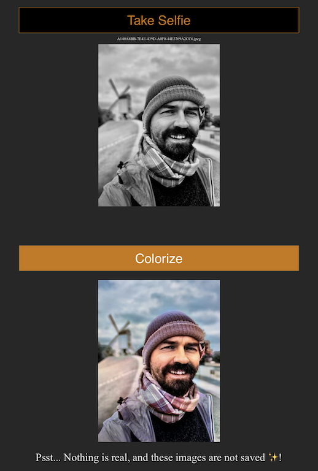

# I Know You Can See Me

Explore machine learning biases through colorization AI at [https://iknowyoucanseeme.xyz](https://iknowyoucanseeme.xyz) 🤖🎨

# Modern Citation

>*"If I have seen further it is by standing upon the shoulders of giants"*
>
>*Isaac Newton*

The citation is one of the essential elements of the artistic work of all time: there are invisible but strong influences of what has been read, heard and seen by the artist.
When we think of the citation,we see the work of the artists, of all those who created not from scratch, but from the world around them.

But today, a totally different kind of citation emerges. And this citation influences many aspects of our daily life.
We live in the digital era and many algorithms make decisions for us and in place of  us. When you pass the border control or use your new smartphone, cameras look at you: they capture you, create a digital imprint and interpret the "digital you" in their own way. All of these algorithms are based on the vast datasets collected to train and improve its performance. These datasets are the new type of citation, source of inspiration and interpretation for computers.

In my work, I would like to explore how our computers process images, how they view our faces, and how the biases in the dataset used to train these systems can disrupt their clear vision and influence decisions made.
This project is about to feed an artificial intelligence algorithm with black-and-white portraits so that the algorithm create their internal digital representation. Then the algorithm will use this internal representation to reconstruct the color on the images like children use the crayons to do the coloring.

I chose to make portraits of my friends from different backgrounds to explore artificial intelligence algorithm limits and through that visualize the limits of the dataset that feeds it.
The results of colorization - sometimes correct, sometimes very far from reality - can shed light on the biases from the new digital quotations.

I would like to thank [Jason Antic](https://twitter.com/citnaj) for his wonderful work on [DeOldify](https://github.com/jantic/DeOldify/) project.

# Technical details
## ML Model
Deep Learning model to colorize images are come from the incredible work of [Jason Antic](https://twitter.com/citnaj) on his [DeOldify](https://github.com/jantic/DeOldify/) project. Please, follow the project page to get more details about model, data, and training.

## Web App


Web application is based on the Starter for deploying [fast.ai](https://www.fast.ai) models on the Internet. I highly recommend [deep learning course from FastAI](https://course.fast.ai/) team. They are doing an amazing work on making complex things intuitive and easy to understand.

For more details about web app, please check their repo:  [fast.ai](https://github.com/fastai/fastai) 

## Deploy
I deployed this web app on [Google Cloud Run](https://cloud.google.com/run/) service. Cloud Run automatically runs and scales containers in a totally serverless manner. For more information about Cloud Run please see the [documentation](https://cloud.google.com/run/docs/).

My Terminal command to deploy web app on Cloud Run:
```bash
export PROJECT_ID=your_gcp_project_id
gcloud builds submit --tag gcr.io/$PROJECT_ID/iknowyoucanseeme
gcloud run deploy --memory 2Gi --image gcr.io/$PROJECT_ID/iknowyoucanseeme --platform managed
```

----------------------------------------------
(c) Alexander Usoltsev, 2019
